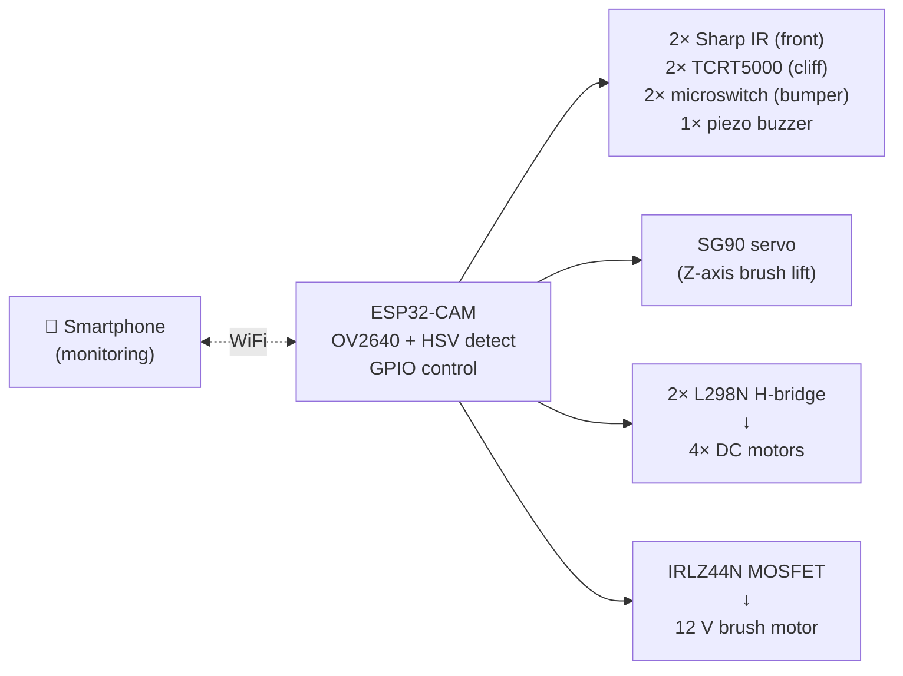

# Forcair


**The open-source robot that cleans your patio while you relax.**

Forcair is a low-cost, open-source autonomous robot that removes moss and weeds from paved surfaces using a rotating brush and computer vision.

Built with aluminum extrusion profiles, 3D printed parts, and an ESP32-CAM. Under 1.3 kg. ~150 EUR from scratch (or ~75 EUR if you reclaim motors + battery + brush motor from junk).

> Named after a vehicle from [*Jayce and the Wheeled Warriors*](https://en.wikipedia.org/wiki/Jayce_and_the_Wheeled_Warriors) (1985).


---

## The Problem

Interlocking pavers and stone patios accumulate **moss and weeds** in their joints. Existing solutions:

| Solution | Cost | Effort | Eco-friendly |
|----------|------|--------|--------------|
| Manual scraping | 0 EUR | Hours on your knees | Yes |
| Pressure washer | 200+ EUR | Heavy, damages joints | Wastes water |
| Chemical herbicide | 10 EUR/year | Easy | **No** |
| Commercial robot mower | 1000+ EUR | N/A on pavers | N/A |
| **Forcair** | **~150 EUR** (or ~75 EUR with reclaimed parts) | **Autonomous** | **Yes** |

## How It Works

| Step | What | How |
|---|---|---|
| **1. Detect** | ESP32-CAM sees green moss on gray pavers | HSV color thresholding (no cloud, on-device) |
| **2. Navigate** | Bump & turn — or systematic sweep on ~150 m² | Phase 1.5 reactive → Phase 2 IMU dead reckoning → Phase 3 GPS RTK |
| **3. Clean** | Rotating brush scrubs the joint | Nylon or steel wire, ~50 mm disc, drill-style attachment |

The robot patrols your patio autonomously. When the camera detects green moss, it lowers the rotating brush and scrubs the joint clean. Simple, mechanical, effective.

## Specifications

| Parameter | Value |
|-----------|-------|
| Dimensions | 300 x 250 x 100 mm |
| Weight | ~1.3 kg |
| Frame | Aluminum 2020 extrusion profiles |
| Wheels | 4x 80mm (PETG hub + TPU tire), 4WD |
| Brain | ESP32-CAM (camera + WiFi + GPIO) |
| Motor driver | L298N dual H-bridge (2 A/ch, PWM + IN1/IN2) ×2 |
| Brush | Rotary nylon or steel wire, 50mm, on Z-axis |
| Battery | 3S 18650 pack (11.1V), ~1h15 autonomy |
| Navigation | Bump & turn (Phase 1) → IMU dead reckoning (Phase 2) → GPS RTK (Phase 3) |
| Detection | HSV green-on-gray thresholding (inspired by [OWL](https://github.com/geezacoleman/OpenWeedLocator)) |
| Manufacturing | 3D printing (Bambu Lab X1C) + off-the-shelf parts |
| **Total cost** | **~150 EUR** from scratch, all-in (or ~75 EUR if you reclaim motors + battery + brush motor) — see [live BOM widget](https://sourcier.shop/bom/SebE585/forcair) |

## Project Status

| Phase | Status | Description |
|-------|--------|-------------|
| **Phase 0** | **In progress** | Manual brush testing (drill + brush on pavers) |
| Phase 1 | Planned | Wheeled base + ESP32-CAM scout + remote control |
| Phase 1.5 | Planned | Bump & turn by zones (~30m² per session) |
| Phase 2 | Future | Systematic sweep with IMU dead reckoning (MPU6050) for 150m² |
| Phase 3 | Future | GPS RTK (u-blox F9P + NTRIP) for full autonomous coverage |

## Build Your Own

### Bill of Materials (BOM)

The BOM is maintained as a machine-readable [`BOM.yaml`](BOM.yaml) at the root of this repo
and consumed by [sourcier.shop](https://sourcier.shop) to generate a live, always-up-to-date
sourcing widget with vendor links optimized per country.

> 🛒 **Live BOM widget:** [**sourcier.shop/bom/SebE585/forcair**](https://sourcier.shop/bom/SebE585/forcair)
>
> One click to see all 27 components, vendor matches (Motedis, AliExpress, Leroy Merlin…),
> per-line and total estimated cost, with country-aware vendor selection (FR/DE/UK/US).
> Supports `?lang=fr|en` for multilingual descriptions.

The BOM is organized in 5 supply lanes:

- **A — AliExpress**: electronics + small mechanical hardware (bearings, drivers, sensors, connectors, screws)
- **B — Motedis**: aluminum 2020 extrusion (custom-cut profiles, corner brackets, T-nuts)
- **C — Bambu Lab Store**: filament (PETG translucent blue dome + TPU 95A tires + PETG black chassis)
- **D — Hardware store / Brico**: plywood platform, drill brushes, PG7 cable glands, foam seals
- **E — Reclaimed from junk**: see table below — these items are not in the public BOM since they
  depend on what donors you can find locally

Need to add a vendor or update a price? Edit [`BOM.yaml`](BOM.yaml) and Sourcier will pick it up
within 1 hour (cache TTL). The BOM.yaml format spec is documented at
[sourcier.shop/spec/bom-yaml](https://sourcier.shop/spec/bom-yaml).

#### Reclaimed from junk — project-specific (not in BOM.yaml)

| Part | Source | Notes |
|---|---|---|
| 4× DC traction motors | Old inkjet printers | Canon MG6450, Epson XP-2150 |
| ESP32-CAM | Stock | Phase 1 brain |
| RPi Zero 2W | Stock | Phase 2 vision |
| GoPro Hero 3+ | Stock | Phase 2 mapping |
| 8 mm linear rods (Z-axis) | Old printers | 2× recovered |
| 12 V brush motor | Reclaimed vacuum (Telsa 80) | or ~5 EUR if no donor |
| 3S 18650 battery pack | Reclaimed Ryobi 36V | or ~15 EUR new pack |
| Springs (Z-axis return) | Old printers | Multiple |

#### 3D printed parts — free (you supply filament from supply lane C)

| Part | Material | Print time | Notes |
|---|---|---|---|
| 4× wheel hubs | PETG black | ~1 h each | 608ZZ housing |
| 4× tires | TPU 95A black | ~45 min each | Striped tread |
| 4× motor mounts | PETG black | ~30 min each | 2020 cradle |
| Brush Z-axis carriage | PETG black | ~2 h | IMS-002 |
| 2× linear bearings | PETG black | ~15 min each | 8 mm rods |
| **Dome cover** | **PETG translucent blue** | ~3 h | The signature shell, PCBs visible through |
| ESP32-CAM mount | PETG black | ~15 min | + tilt adjustment |
| Brush confinement skirt | TPU 95A black | ~45 min | Soft seal under chassis |
| Front bumper | TPU 95A black | ~30 min | Integrates micro-switches |
| IR sensor mount (front) | PETG black | ~15 min | |
| 2× cliff sensor mounts | PETG black | ~10 min each | |

### Total budget (Phase 1.5 functional)

| Lane | Cash |
|---|---|
| A — AliExpress (electronics + mechanical) | ~55 EUR |
| B — Motedis (custom-cut extrusion) | ~20 EUR |
| C — Bambu Lab (filament dedicated to Forcair) | ~30 EUR |
| D — Brico (plywood, brushes, seals, PG7) | ~18 EUR |
| E — Reclaimed parts | 0 EUR |
| Shipping & misc | ~10 EUR |
| **Total cash, all-in** | **~135-155 EUR** |
| Total saved by reclaiming (vs new) | ~50 EUR |

The original "<75 EUR" target on the project banner refers to the bare-minimum Phase 1
electronics-only build assuming all reclaimable parts are available (motors, battery, brush motor,
linear rods). Real-world cost for a from-scratch build sits closer to **~150 EUR** including
filament and shipping. See the live [Sourcier widget](https://sourcier.shop/bom/SebE585/forcair)
for the up-to-date estimate based on current vendor prices.

### CAD Files

All mechanical parts are parametric, written in [CadQuery](https://cadquery.readthedocs.io/) (Python).
STEP and STL exports are provided for direct slicing.

```
hardware/cad/
├── assembly_chassis.py      # Full assembly visualization
├── wheel_hub.py             # PETG wheel hub (WH-001)
├── wheel_tire.py            # TPU tire (WT-001)
├── motor_mount.py           # Motor cradle for 2020 profile
├── ims_plate.py             # Interchangeable Module Standard plate
├── mod002_brosse.py         # Rotating brush module (MOD-002)
├── esp32_cam_mount.py       # ESP32-CAM bracket with tilt
├── capot_dome.py            # Protective dome (PETG translucent blue)
├── step/                    # STEP exports
└── stl/                     # STL exports (ready to print)
```

### Printing Guide

| Part | Material | Infill | Pattern | Perimeters | Layer | Time |
|------|----------|--------|---------|------------|-------|------|
| Wheel hubs (x4) | PETG | 40% | gyroid | 4 | 0.2mm | ~45min each |
| Tires (x4) | TPU 95A | 20% | gyroid | 3 | 0.2mm | ~40min each |
| Motor mounts (x4) | PETG | 40% | gyroid | 4 | 0.2mm | ~25min each |
| Dome cover | PETG (translucent blue) | 15% | gyroid | 3 | 0.2mm | ~3h |
| All other parts | PETG | 30-40% | gyroid | 3 | 0.2mm | varies |
| **Total Phase 1** | | | | | | **~10-11h** |

**Why not 100% infill on wheels and tires?**

- **Wheel hubs (PETG, 40% gyroid)** — for a 1.3 kg robot (~330 g per wheel), radial and torsional loads are carried by the perimeters, not the infill. 4 walls + 40% gyroid is plenty; 100% just wastes filament and print time without measurable benefit.
- **Tires (TPU 95A, 20% gyroid)** — the whole point of TPU is compliance (grip + shock absorption). Printing TPU at 100% gives a *rigid* rubber tire with no give, which actively defeats the purpose: less grip on uneven pavers, more vibration into the chassis. 15-25% gyroid keeps the tire deformable enough to conform to joints while staying durable.

## Research & State of the Art

See [`research/state-of-the-art.md`](research/state-of-the-art.md) for a comprehensive literature review covering:

- 12+ similar DIY/open-source projects analyzed
- 24 scientific papers reviewed
- Validation of the rotating brush approach on hard surfaces ([Rask & Kristoffersen 2007](https://doi.org/10.1111/j.1365-3180.2007.00579.x))
- Identified gap: **no published work on autonomous robotic weeding for domestic paved surfaces**

Key references:
- [OpenWeedLocator (OWL)](https://github.com/geezacoleman/OpenWeedLocator) - green-on-brown detection algorithm we adapt to green-on-gray
- [Tertill](https://tertill.com/) (discontinued) - bump & turn navigation validated for small surfaces
- [LIAM-ESP](https://github.com/trycoon/liam-esp) - ESP32 navigation code reference

## Modular Tool System (IMS)

Forcair uses an **Interchangeable Module Standard** (IMS) interface — a single 100×80 mm plate
with a fixed mechanical and electrical pinout. Modules clip on tool-free in ~30 seconds.

**IMS Plate spec** (100 × 80 mm):

| Feature | Spec | Purpose |
|---|---|---|
| Fixation | 2× M5 butterfly bolts | Tool-free swap in ~30 s |
| Alignment | 2× centering posts, ⌀ 8 mm | Repeatable positioning |
| Power | XT60 connector | 12 V, 10 A continuous |
| Signal | JST-XH 3-pin | PWM control + ground |

| Module | Function | Status |
|--------|----------|--------|
| MOD-002 | Rotating brush (nylon/steel) | Phase 1.5 |
| MOD-001 | Camera scout (GoPro) | Phase 2 |
| MOD-003 | Spray (water or anti-moss) | Future |
| MOD-004 | Leaf blower | Future |

Design your own module! The IMS plate CAD file is in `hardware/cad/ims_plate.py`.

## Architecture

**Phase 1.5 — ESP32-CAM only** (~150 EUR from scratch / ~75 EUR with reclaimed parts):



**Phase 2** (+2 EUR) — add an MPU6050 IMU for dead-reckoning navigation, enabling systematic
line sweeps over ~150 m².

**Phase 3** (+40 EUR) — add a u-blox F9P GPS-RTK receiver with NTRIP corrections for
centimeter-level outdoor positioning and full coverage planning.

## Contributing

Contributions welcome! Here's how you can help:

- **Build one** and share your results (especially with different paver types)
- **Improve the firmware** (ESP32 Arduino or ESP-IDF)
- **Design new modules** for the IMS interface
- **Test different brushes** and document effectiveness vs. joint wear
- **Translate** documentation
- **Report issues** or suggest improvements

## License

- **Hardware** (CAD, mechanical design): [CERN-OHL-S v2](LICENSE-HARDWARE)
- **Software** (firmware, scripts): [MIT](LICENSE-SOFTWARE)
- **Documentation**: [CC BY-SA 4.0](https://creativecommons.org/licenses/by-sa/4.0/)

## Related Projects

Forcair is part of a family of DIY projects, all named after vehicles from *Jayce and the Wheeled Warriors*:

| Project | Description |
|---------|-------------|
| **Forcair** | Autonomous paver weeding robot (this project) |
| Vrillair | DIY CNC machine |
| Blindair | Modular workshop storage boxes |
| Depistair | Reclaimed parts inventory & shared BOM |

## Acknowledgments

- [OpenWeedLocator](https://github.com/geezacoleman/OpenWeedLocator) for the green-on-brown detection approach
- [Tertill](https://tertill.com/) (Franklin Robotics) for proving bump & turn works
- [LIAM-ESP](https://github.com/trycoon/liam-esp) for ESP32 navigation patterns
- The scientific work of Rask & Kristoffersen (2007) and Cauwer et al. (2014) on non-chemical weed control on hard surfaces

---

*Forcair is a personal open-source project. Not affiliated with any company.*
