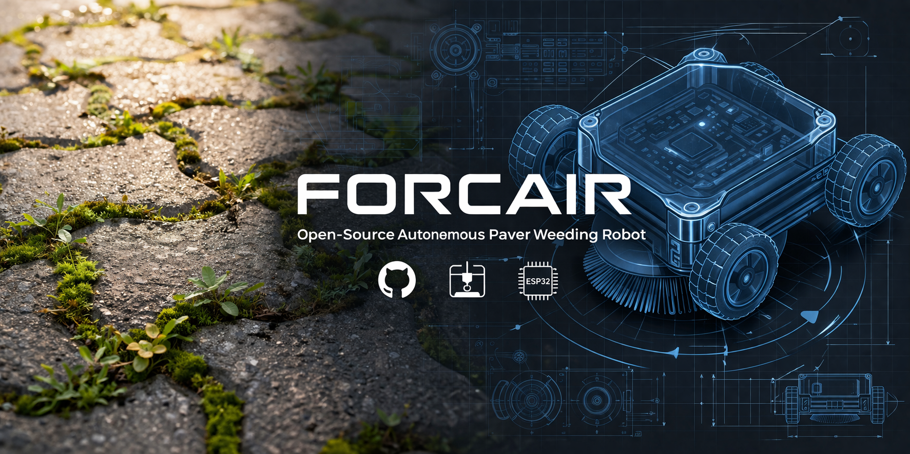
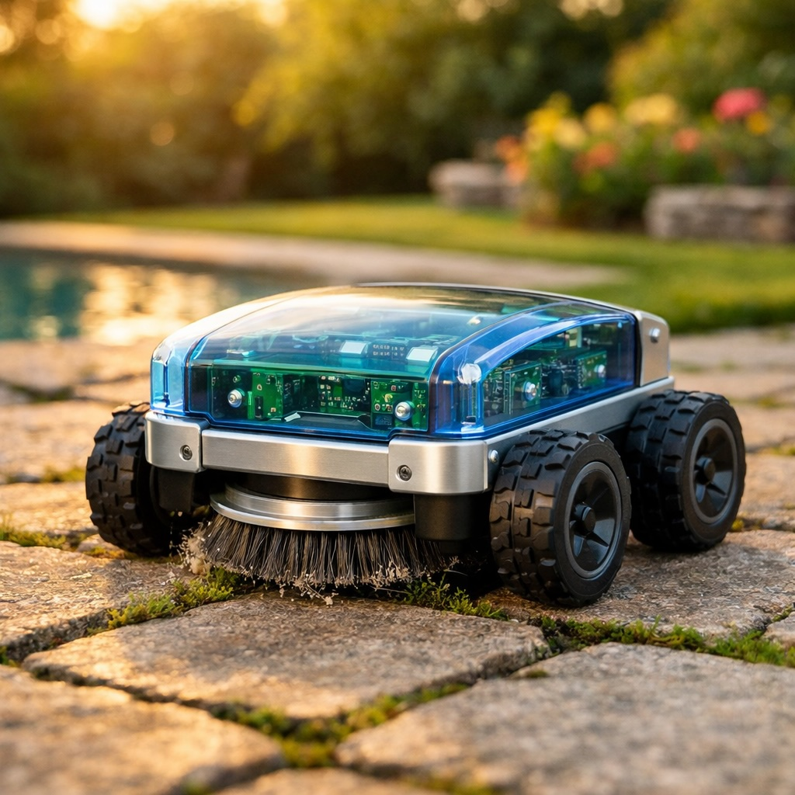

# Forcair



**The open-source robot that cleans your patio while you relax.**

Forcair is a low-cost, open-source autonomous robot that removes moss and weeds from paved surfaces using a rotating brush and computer vision.

Built with aluminum extrusion profiles, 3D printed parts, and an ESP32-CAM. Under 1.3 kg. Under 100 EUR.

> Named after a vehicle from [*Jayce and the Wheeled Warriors*](https://en.wikipedia.org/wiki/Jayce_and_the_Wheeled_Warriors) (1985).



---

## The Problem

Interlocking pavers and stone patios accumulate **moss and weeds** in their joints. Existing solutions:

| Solution | Cost | Effort | Eco-friendly |
|----------|------|--------|--------------|
| Manual scraping | 0 EUR | Hours on your knees | Yes |
| Pressure washer | 200+ EUR | Heavy, damages joints | Wastes water |
| Chemical herbicide | 10 EUR/year | Easy | **No** |
| Commercial robot mower | 1000+ EUR | N/A on pavers | N/A |
| **Forcair** | **~75 EUR** | **Autonomous** | **Yes** |

## How It Works

```
  1. DETECT            2. NAVIGATE           3. CLEAN
  ESP32-CAM sees      Bump & turn or        Rotating brush
  green moss on       systematic sweep      scrubs joints
  gray pavers         (~150m2 coverage)     automatically
  (HSV threshold)     (IMU → RTK roadmap)   (nylon or steel)
```

The robot patrols your patio autonomously. When the camera detects green moss (computer vision, no cloud), it lowers a rotating brush and scrubs the joint clean. Simple, mechanical, effective.

## Specifications

| Parameter | Value |
|-----------|-------|
| Dimensions | 300 x 250 x 100 mm |
| Weight | ~1.3 kg |
| Frame | Aluminum 2020 extrusion profiles |
| Wheels | 4x 80mm (PETG hub + TPU tire), 4WD |
| Brain | ESP32-CAM (camera + WiFi + GPIO) |
| Motor driver | MX1508 dual H-bridge (1.5 A/ch, 4× PWM input) ×2 |
| Brush | Rotary nylon or steel wire, 50mm, on Z-axis |
| Battery | 3S 18650 pack (11.1V), ~1h15 autonomy |
| Navigation | Bump & turn (Phase 1) → IMU dead reckoning (Phase 2) → GPS RTK (Phase 3) |
| Detection | HSV green-on-gray thresholding (inspired by [OWL](https://github.com/geezacoleman/OpenWeedLocator)) |
| Manufacturing | 3D printing (Bambu Lab X1C) + off-the-shelf parts |
| **Total cost** | **~75 EUR** (including shared hardware order) |

## Project Status

| Phase | Status | Description |
|-------|--------|-------------|
| **Phase 0** | **In progress** | Manual brush testing (drill + brush on pavers) |
| Phase 1 | Planned | Wheeled base + ESP32-CAM scout + remote control |
| Phase 1.5 | Planned | Bump & turn by zones (~30m² per session) |
| Phase 2 | Future | Systematic sweep with IMU dead reckoning (MPU6050) for 150m² |
| Phase 3 | Future | GPS RTK (u-blox F9P + NTRIP) for full autonomous coverage |

## Build Your Own

### Bill of Materials (BOM)

> **Source all parts in one click:** [**Open BOM on Sourcier**](https://sourcier.shop/bom/forcair) — Sourcier finds validated AliExpress vendors for each component and groups them by seller to minimize shipping costs.

The BOM is organized in 5 supply lanes. Total target: **~140 EUR cash + ~50 EUR saved by reclaiming parts**.

#### A. AliExpress — electronics + small mechanical (~52 EUR)

| Sourcier ref | Part | Qty | Use | ~Price |
|---|---|---|---|---|
| `MEC-001` | 608ZZ bearings | lot of 10 | Wheel hubs (4 used) | 4 EUR |
| `MEC-010` | Rigid shaft couplers 5mm-8mm | 4 | Motor → wheel axle | 5 EUR |
| `MEC-012` | Aluminum shaft collars 8mm | lot of 10 | Wheel axial retention | 3 EUR |
| `ELE-014` | **MX1508** dual motor driver | 2 | 4 traction motors (2 ch each) | 2 EUR |
| `ELE-031` | Sharp GP2Y0A21 IR sensor | 2 | Front obstacle detection | 3 EUR |
| `ELE-032` | TCRT5000 cliff sensor | 2 | Drop detection (stairs) | 1 EUR |
| `ELE-033` | Micro-switch lever (snap-action) | 4 | Front bumpers + spares | 1 EUR |
| `ELE-040` | Passive piezo buzzer | 1 | Audio feedback | 1 EUR |
| `ELE-021` | SG90 servo (180° **with limit**) | 3 | MOD-002 brush Z-axis + spares | 5 EUR |
| `ELE-050` | MOSFET IRLZ44N (logic-level) | 5 | Brush motor switching | 3 EUR |
| `ELE-051` | Buck MP1584EN adjustable | 2 | 5 V from 12 V battery | 2 EUR |
| `ELE-060` | BMS 3S 25 A | 1 | 18650 pack protection | 2 EUR |
| `ELE-030` | MPU6050 IMU | 1 | Phase 2 dead reckoning | 2 EUR |
| `CON-001` | XT60 connector pairs | 5 | IMS power | 4 EUR |
| `CON-002` | JST-XH 3-pin connectors | lot of 10 | IMS signal | 2 EUR |
| `CON-003` | Dupont jumper kit (M-M / M-F / F-F) | 1 | Prototyping | 2 EUR |
| `VIS-001` | M3 screw assortment kit (~480 pcs) | 1 | General fixation | 8 EUR |
| `VIS-004` | M3 brass standoffs kit | 1 | PCB mounting | 5 EUR |
| `ELE-070` | Breadboard 830 points (MB-102) | 1 | MX1508 + ESP32-CAM bench | 2 EUR |

#### B. Motedis — aluminum extrusion (~25 EUR)

| Part | Qty | ~Price |
|---|---|---|
| 2020 V-slot profile, 1 m | 5 | 18 EUR |
| Corner brackets 2020 | 20 | 6 EUR |
| M5 T-nuts (lot of 100) | 1 | 6 EUR |

#### C. Bambu Lab Store — filament (~55 EUR)

| Part | Qty | ~Price |
|---|---|---|
| **PETG HF Translucent Blue** (signature dome) | 1 kg | 25 EUR |
| **TPU 95A HF Black** (tires + skirt + bumper) | 500 g | 18 EUR |
| PETG HF Black (chassis parts, optional if in stock) | 1 kg | 12 EUR |

#### D. Hardware store / Brico (~18 EUR)

| Part | Qty | ~Price |
|---|---|---|
| 5 mm plywood platform | 1 | 3 EUR |
| Nylon drill brush attachment | 1 | 5 EUR |
| Steel wire drill brush attachment | 1 | 5 EUR |
| PG7 cable glands | 4 | 3 EUR |
| Adhesive foam strip (sealing) | 1 | 2 EUR |

#### E. Reclaimed from junk — FREE

| Part | Source | Notes |
|---|---|---|
| 4× DC traction motors | Old inkjet printers | Canon MG6450, Epson XP-2150 |
| ESP32-CAM | Stock | Phase 1 brain |
| RPi Zero 2W | Stock | Phase 2 vision |
| GoPro Hero 3+ | Stock | Phase 2 mapping |
| 8 mm linear rods (Z-axis) | Old printers | 2× recovered |
| 12 V brush motor | Reclaimed vacuum (Telsa 80) | or ~5 EUR if no donor |
| 3S 18650 battery pack | Reclaimed Ryobi 36V | or ~15 EUR new pack |
| Springs (Z-axis return) | Old printers | Multiple |

#### F. 3D printed — free (you supply filament from C)

| Part | Material | Print time | Notes |
|---|---|---|---|
| 4× wheel hubs | PETG black | ~1 h each | 608ZZ housing |
| 4× tires | TPU 95A black | ~45 min each | Striped tread |
| 4× motor mounts | PETG black | ~30 min each | 2020 cradle |
| Brush Z-axis carriage | PETG black | ~2 h | IMS-002 |
| 2× linear bearings | PETG black | ~15 min each | 8 mm rods |
| **Dome cover** | **PETG translucent blue** | ~3 h | The signature shell, PCBs visible through |
| ESP32-CAM mount | PETG black | ~15 min | + tilt adjustment |
| Brush confinement skirt | TPU 95A black | ~45 min | Soft seal under chassis |
| Front bumper | TPU 95A black | ~30 min | Integrates micro-switches |
| IR sensor mount (front) | PETG black | ~15 min | |
| 2× cliff sensor mounts | PETG black | ~10 min each | |

### Total budget

| Source | Cash |
|---|---|
| AliExpress (electronics + mechanical) | ~52 EUR |
| Motedis (extrusion) | ~25 EUR |
| Bambu Lab (filament) | ~45-55 EUR |
| Brico (plywood, brushes, sealing) | ~18 EUR |
| Reclaimed parts | 0 EUR |
| **Total cash spent** | **~140-150 EUR** |
| **Total saved by reclaiming** | **~50 EUR** |

> **Note 2026-04-11** — first AliExpress shipment received and partially audited:
> bearings ✅, M3 kit ✅, MX1508 ⚠ (3/6 received, 50% refund dispute opened),
> SG90 ❌ (wrong variant ordered, re-order with `180° with limit` required).
> The MX1508 chip replaces the design's original TB6612FNG — see
> `hardware/design-v1.md` for the upcoming pinout patch (4× PWM inputs vs PWM+DIR).

### CAD Files

All mechanical parts are parametric, written in [CadQuery](https://cadquery.readthedocs.io/) (Python).
STEP and STL exports are provided for direct slicing.

```
hardware/cad/
├── assembly_chassis.py      # Full assembly visualization
├── wheel_hub.py             # PETG wheel hub (WH-001)
├── wheel_tire.py            # TPU tire (WT-001)
├── motor_mount.py           # Motor cradle for 2020 profile
├── ims_plate.py             # Interchangeable Module Standard plate
├── mod002_brosse.py         # Rotating brush module (MOD-002)
├── esp32_cam_mount.py       # ESP32-CAM bracket with tilt
├── capot_dome.py            # Protective dome (PETG translucent blue)
├── step/                    # STEP exports
└── stl/                     # STL exports (ready to print)
```

### Printing Guide

| Part | Material | Infill | Layer | Time |
|------|----------|--------|-------|------|
| Wheel hubs (x4) | PETG | 100% | 0.2mm | ~1h each |
| Tires (x4) | TPU 95A | 100% | 0.2mm | ~45min each |
| Motor mounts (x4) | PETG | 80% | 0.2mm | ~30min each |
| Dome cover | PETG (translucent blue) | 20% | 0.2mm | ~3h |
| All other parts | PETG | 50% | 0.2mm | varies |
| **Total Phase 1** | | | | **~12-13h** |

## Research & State of the Art

See [`research/state-of-the-art.md`](research/state-of-the-art.md) for a comprehensive literature review covering:

- 12+ similar DIY/open-source projects analyzed
- 24 scientific papers reviewed
- Validation of the rotating brush approach on hard surfaces ([Rask & Kristoffersen 2007](https://doi.org/10.1111/j.1365-3180.2007.00579.x))
- Identified gap: **no published work on autonomous robotic weeding for domestic paved surfaces**

Key references:
- [OpenWeedLocator (OWL)](https://github.com/geezacoleman/OpenWeedLocator) - green-on-brown detection algorithm we adapt to green-on-gray
- [Tertill](https://tertill.com/) (discontinued) - bump & turn navigation validated for small surfaces
- [LIAM-ESP](https://github.com/trycoon/liam-esp) - ESP32 navigation code reference

## Modular Tool System (IMS)

Forcair uses an **Interchangeable Module Standard** (IMS) interface:

```
     ┌──── IMS Plate (100x80mm) ────┐
     │  2x M5 butterfly bolts       │  ← tool-free swap in 30 seconds
     │  2x centering posts (8mm)    │
     │  XT60 connector (12V, 10A)   │
     │  JST-XH 3-pin (PWM signal)  │
     └──────────────────────────────┘
```

| Module | Function | Status |
|--------|----------|--------|
| MOD-002 | Rotating brush (nylon/steel) | Phase 1.5 |
| MOD-001 | Camera scout (GoPro) | Phase 2 |
| MOD-003 | Spray (water or anti-moss) | Future |
| MOD-004 | Leaf blower | Future |

Design your own module! The IMS plate CAD file is in `hardware/cad/ims_plate.py`.

## Architecture

```
Phase 1-1.5 (ESP32-CAM only, ~75 EUR):

  ┌─────────────┐    WiFi     ┌──────────────┐
  │  ESP32-CAM  │◄───────────►│   Smartphone  │
  │  OV2640 cam │             │  (monitoring) │
  │  HSV detect │             └──────────────┘
  │  GPIO ctrl  │
  └──┬───┬──┬───┘
     │   │  └──── 2x IR Sharp + 2x bumper + 2x cliff + buzzer
     │   └─────── SG90 servo (Z-axis)
     └─────────── 2× MX1508 → 4× DC motors + IRLZ44N → brush motor

Phase 2 (+2 EUR): add MPU6050 IMU → systematic line sweep, 150m² coverage
Phase 3 (+40 EUR): add u-blox F9P → GPS RTK via NTRIP, cm-level precision
```

## Contributing

Contributions welcome! Here's how you can help:

- **Build one** and share your results (especially with different paver types)
- **Improve the firmware** (ESP32 Arduino or ESP-IDF)
- **Design new modules** for the IMS interface
- **Test different brushes** and document effectiveness vs. joint wear
- **Translate** documentation
- **Report issues** or suggest improvements

## License

- **Hardware** (CAD, mechanical design): [CERN-OHL-S v2](LICENSE-HARDWARE)
- **Software** (firmware, scripts): [MIT](LICENSE-SOFTWARE)
- **Documentation**: [CC BY-SA 4.0](https://creativecommons.org/licenses/by-sa/4.0/)

## Related Projects

Forcair is part of a family of DIY projects, all named after vehicles from *Jayce and the Wheeled Warriors*:

| Project | Description |
|---------|-------------|
| **Forcair** | Autonomous paver weeding robot (this project) |
| Vrillair | DIY CNC machine |
| Blindair | Modular workshop storage boxes |
| Depistair | Reclaimed parts inventory & shared BOM |

## Acknowledgments

- [OpenWeedLocator](https://github.com/geezacoleman/OpenWeedLocator) for the green-on-brown detection approach
- [Tertill](https://tertill.com/) (Franklin Robotics) for proving bump & turn works
- [LIAM-ESP](https://github.com/trycoon/liam-esp) for ESP32 navigation patterns
- The scientific work of Rask & Kristoffersen (2007) and Cauwer et al. (2014) on non-chemical weed control on hard surfaces

---

*Forcair is a personal open-source project. Not affiliated with any company.*
